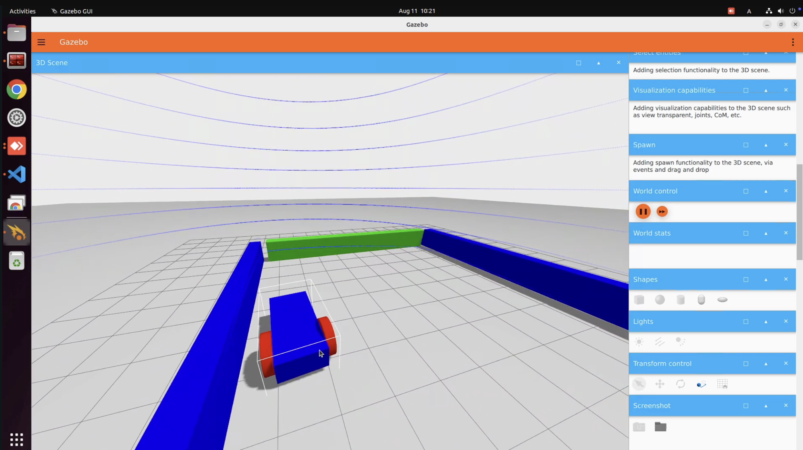

# LiDAR simulation
## Preliminaries
- ROS 2 Humble
- Gazebo Fortress (ignition)


## YouTube Video
[](https://youtu.be/BaE7Gy0TvX8)


## How to use
### Install ros_gz

```bash
sudo apt install -y ros-humble-ros-gz
```

### Clone and build

```bash
mkdir -p ~/ws_lidar/src
cd ~/ws_lidar/src

git clone https://github.com/ku-gcl/lidar_sim_pkg.git

cd ~/ws_lidar
colcon build --symlink-install
```


### simulation

```bash
source /opt/ros/humble/setup.bash
source ~/ws_lidar/install/setup.bash

ros2 launch lidar_sim_pkg simulation.launch.py
```

### Check topic

<details>
<summary>ign topic -l (see topic list)</summary>

```bash
ign topic -l                # see topic list
---

/clock
/cmd_vel
/gazebo/resource_paths
/gui/camera/pose
/gui/record_video/stats
/imu
/keyboard/keypress
/lidar
/lidar/points
/model/vehicle_blue/odometry
/model/vehicle_blue/tf
/sensors/marker
/stats
/wall/touched
/world/sensor_world/clock
/world/sensor_world/dynamic_pose/info
/world/sensor_world/model/wall/link/box/sensor/sensor_contact/contact
/world/sensor_world/pose/info
/world/sensor_world/scene/deletion
/world/sensor_world/scene/info
/world/sensor_world/state
/world/sensor_world/stats
```
</details>

<details>
<summary>ign topic -e -t /lidar (see lidar topic data)</summary>

```bash
ign topic -e -t /lidar      # echo /lidar topic data
---

header {
  stamp {
    sec: 165
    nsec: 500000000
  }
  data {
    key: "frame_id"
    value: "vehicle_blue::chassis::gpu_lidar"
  }
  data {
    key: "seq"
    value: "1671"
  }
}
frame: "vehicle_blue::chassis::gpu_lidar"
world_pose {
  position {
    x: 0.8
    z: 0.7
  }
  orientation {
    w: 1
  }
}
angle_min: -3.1415926536
angle_max: 3.1415926536
angle_step: 0.0031431642357178588
range_min: 0.1
range_max: 10
count: 2000
vertical_angle_min: -0.122173048
vertical_angle_max: 0.907571211
vertical_angle_step: 0.026403698948717951
vertical_count: 40
ranges: 3.1339066028594971
ranges: 3.1846680641174316
ranges: 3.1596453189849854
ranges: 3.183290958404541
ranges: 3.15217661857605
ranges: 3.1883203983306885
ranges: 3.1930842399597168
ranges: 3.1721608638763428
...

intensities: 0
intensities: 0
intensities: 0
intensities: 0
intensities: 0
intensities: 0
intensities: 0
intensities: 0
intensities: 0
...
```
</details>


## Livox Mid-360 Specs
|  # | Item                        | Value                                                       |
| -: | --------------------------- | ----------------------------------------------------------- |
|  1 | Model                       | MID-360                                                     |
|  2 | Laser Wavelength            | 905 nm                                                      |
|  3 | Laser Safety                | Class 1 (IEC 60825-1:2014)                                  |
|  4 | Detection Range (@100 klx)  | **40 m @ 10% reflectivity** / 70 m @ 80% reflectivity           |
|  5 | Close Proximity Blind Zone  | 0.1 m                                                       |
|  6 | Field of View (FOV)         | **Horizontal 360° / Vertical −7° to +52° (59° total)**          |
|  7 | Range Precision (1σ)        | ≤ 2 cm (@10 m) / ≤ 3 cm (@0.2 m)                            |
|  8 | Angular Precision (1σ)      | < 0.15°                                                     |
|  9 | Point Rate                  | **200,000 points/s (first return)**                             |
| 10 | Frame Rate                  | **10 Hz (typical)**                                             |
| 11 | Data Port                   | 100BASE-TX Ethernet                                         |
| 12 | Time Sync                   | IEEE 1588-2008 (PTPv2), GPS                                 |
| 13 | Anti-Interference Function  | Available                                                   |
| 14 | False Alarm Rate (@100 klx) | < 0.01%                                                     |
| 15 | IMU                         | Built-in ICM40609                                           |
| 16 | Operating Temperature       | −20°C to 55°C (−4°F to 131°F)                               |
| 17 | IP Rating                   | IP67                                                        |
| 18 | Power (avg.)                | 6.5 W (may peak to \~14 W in self-heating mode at low temp) |
| 19 | Power Supply Voltage        | 9–27 V DC                                                   |
| 20 | Dimensions                  | 65 × 65 × 60 mm                                             |
| 21 | Weight                      | 265 g                                                       |


You can configure the LiDAR by editing [worlds/sensor_tutorial.sdf](worlds/sensor_tutorial.sdf).
Below are the key LiDAR settings. Adjust to match your device.

- update_rate
- horizontal.samples
- horizontal.min_angle
- horizontal.max_angle
- vertical.samples
- vertical.min_angle
- vertical.max_angle
- range.min
- range.max

> [!NOTE]
> The real Livox Mid-360 uses a **non-reptitive scanning pattern** that fills its FOV over time rather than a fixed grid per frame.
> For simplify in this simulation, we approximate it with a uniform grid: 
> **2000 horizontal samples x 10 vertical samples at `update_rate` = 10 Hz**, which yields **≈200,000 points/s**.


```sdf
<sensor name='gpu_lidar' type='gpu_lidar'>
    <pose relative_to='lidar_frame'>0 0 0.2 0 0 0</pose>
    <topic>lidar</topic>
    <update_rate>10</update_rate>
    <ray>
        <scan>
            <horizontal>
                <samples>2000</samples>
                <resolution>1</resolution>
                <min_angle>-3.1415926536</min_angle>
                <max_angle> 3.1415926536</max_angle>
            </horizontal>

            <vertical>
                <samples>10</samples>
                <resolution>1</resolution>
                <min_angle>-0.122173048</min_angle>
                <max_angle> 0.907571211</max_angle>
            </vertical>
        </scan>

        <range>
            <min>0.10</min>
            <max>10.0</max>
            <resolution>0.01</resolution>
        </range>
        <noise>
            <type>gaussian</type>
            <mean>0.0</mean>
            <stddev>0.02</stddev>
        </noise>
    </ray>
    <always_on>1</always_on>
    <visualize>true</visualize>
</sensor>
```


## Reference
### Gazebo
- [Gazebo sensors tutorial](https://gazebosim.org/docs/fortress/sensors/)
- [Gazebo sensors tutorial code](https://github.com/gazebosim/docs/tree/master/fortress/tutorials/sensors)
- [ros_gz](https://github.com/gazebosim/ros_gz?tab=readme-ov-file)

### Livox Mid-360
- [Livox Mid-360 Specs](https://www.livoxtech.com/jp/mid-360/specs)

